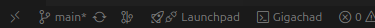
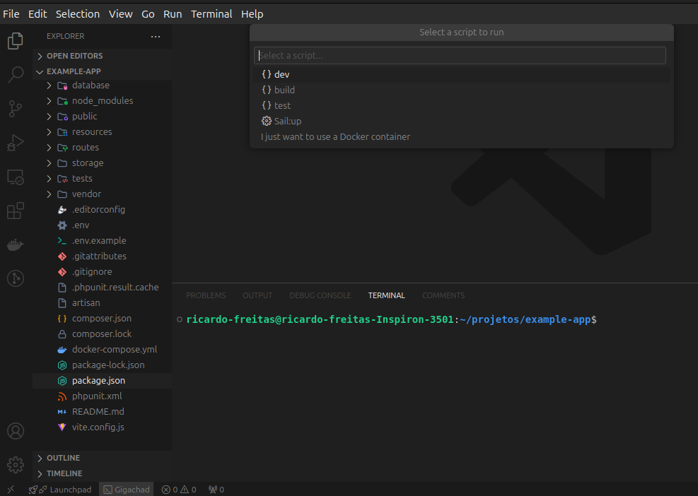
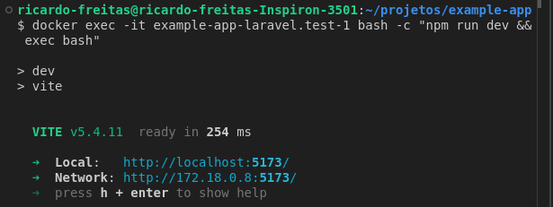

# Gigachad Scripts Runner

Is a VS Code extension that simplifies running scripts defined in `package.json` or custom configurations. It also enables running scripts inside Docker containers, providing greater flexibility and integration with container-based development environments.

---

## 🚀 **Features**

- List scripts defined in `package.json`.
- Integration with custom configurations for additional scripts.
- Execute scripts directly in the VS Code terminal.
- Support for running commands inside Docker containers.
- Automatic detection of the package manager (`npm` or `yarn`).

## Use

Find Gigachad icon in status bar



Select script to execute



See the result in the terminal



### Example of Custom Configuration:

In the VSCode configuration file (`settings.json`), add the custom scripts you want to execute. Here is an example:

```json
"gigachad.customScripts": [
  {
    "name": "build:docker",
    "command": "docker-compose up --build",
    "group": "example-app"
  },
]
```

Here’s the table in Markdown format explaining the JSON configuration in English:

markdown
Copiar código

### Explanation of the JSON Configuration

| Field     | Description                                                                                                 | Example                       |
| --------- | ----------------------------------------------------------------------------------------------------------- | ----------------------------- |
| `name`    | The name of the custom script that will appear in the VSCode interface.                                     | `"build:docker"`,             |
| `command` | The command to be executed in the terminal when the script is triggered. It can be any valid shell command. | `"docker-compose up --build"` |
| `group`   | (Optional) The group to which the script belongs. This helps in organizing scripts into categories.         | `"example-app"`               |
